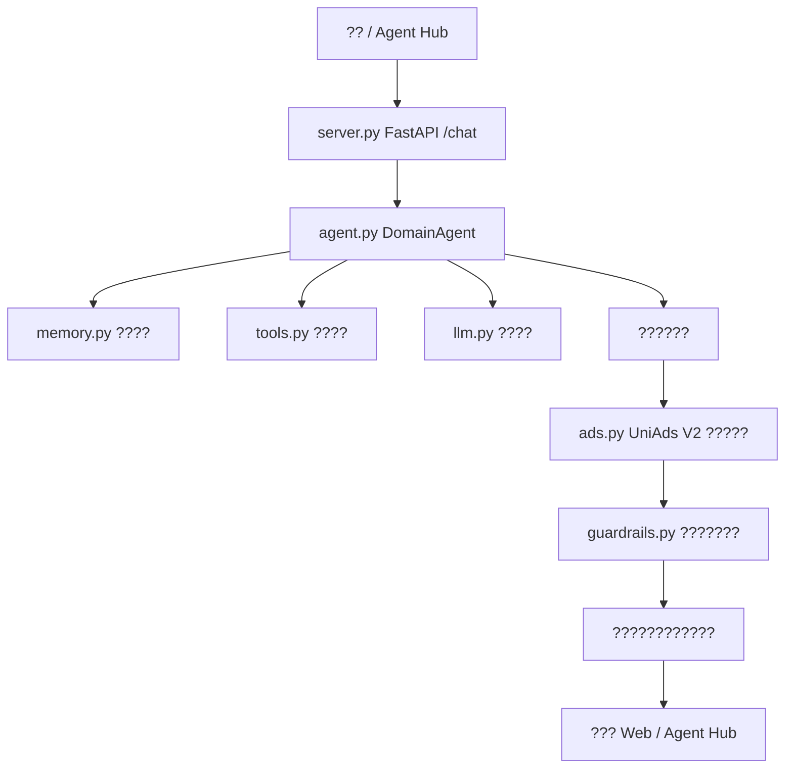

# Uni-Agent-Template ????

[English README](README.md) | ????

`Uni-Agent-Template` ???????????? Agent ????????????? UniAds Agent Hub ?????????????**???????????????????????**???????????? Agent ??????

????????????????????? Agent ????????

- [OpenAI Agents SDK for Python](https://github.com/openai/openai-agents-python)???????? Agent ?????
- [OpenAI Agents SDK for TypeScript](https://github.com/openai/openai-agents-js)?????? Agent ???
- [LangChain](https://github.com/langchain-ai/langchain)??????????Agent ?????????
- [LangChain Open Agent Platform](https://github.com/langchain-ai/open-agent-platform)?Agent ??????MCP ?????????????

?????????????????????? UniAds ?????????

## ??????

- `src/uni_agent_template/` ????? Python ??
- ?? OpenAI Chat Completions ????????
- UniAds V2 `/v2/sponsor-context` ????????
- ??????????????
- Fail-open ???????????????????
- ?????????
- FastAPI Web ???
- Agent Hub ?????`uniads.agent.json`?
- ?????????????`demo/`?
- ?? smoke test ? pytest ???

## ?????



????????[docs/ARCHITECTURE.md](docs/ARCHITECTURE.md)?

## ????

```bash
python -m venv .venv
. .venv/Scripts/activate  # Windows
pip install -e .[server,test]
copy .env.example .env
python scripts/smoke_test.py "??????? Agent ????????"
uvicorn uni_agent_template.server:create_app --factory --host 127.0.0.1 --port 8080
```

?????

```bash
curl -X POST http://127.0.0.1:8080/chat ^
  -H "Content-Type: application/json" ^
  -d "{\"message\":\"??????????????\",\"language\":\"zh\"}"
```

## ???????? Agent

?? [demo/README.md](demo/README.md) ?????????????? 6 ??

1. ???????
2. ??????????
3. ??? Agent ???
4. ?? UniAds V2 ??????
5. ? FastAPI ?? Web ???
6. ?? Agent Hub ????

## ????

??????? `.env`?

```text
MODEL_API_KEY=your-model-key
MODEL_BASE_URL=https://api.openai.com/v1
MODEL_NAME=gpt-4.1-mini
UNIADS_BASE_URL=http://103.242.15.56
UNIADS_DEV_API_KEY=sk-dev-your-key
UNIADS_AGENT_ID=my-agent
UNIADS_AGENT_NAME=My Agent
```

?????? API Key?

## Agent Hub ??

`uniads.agent.json` ???? Agent Hub ??????????

- `name`???????
- `description`?????????????
- `main_functions`????????
- `ad_compatibility`??????? UniAds?
- `supported_protocols`?REST / MCP / SDK ????
- `agent_site_url`??????? Agent ???
- `repository_url`???????????

???

```bash
python scripts/validate_agent_hub_compatibility.py
```

??????[docs/AGENT_HUB_COMPATIBILITY.md](docs/AGENT_HUB_COMPATIBILITY.md)?

## UniAds ????

1. ??????????????????
2. ???? API ????? UniAds ???
3. ???????????????
4. ?????????????????????????????????????
5. UniAds ???????????????????????

## ??????????

- `src/uni_agent_template/agent.py`?????????
- `src/uni_agent_template/tools.py`?????????/API?
- `src/uni_agent_template/memory.py`????????????? Redis?
- `src/uni_agent_template/server.py`?????? HTTP ???
- `uniads.agent.json`?????? Agent Hub ??????

## ???

MIT?? [LICENSE](LICENSE)?
