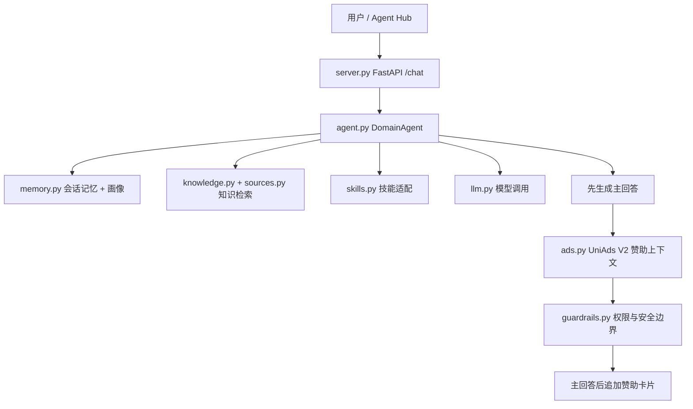

# Uni-Agent-Template 中文说明

[English README](README.md) | 中文说明

`Uni-Agent-Template` 是一个面向开发者的轻量级 Agent 模板，用来快速构建可以接入 UniAds Agent Hub 的智能体。核心原则很简单：**先生成用户需要的主回答，再把赞助内容作为补充信息追加**，避免广告逻辑影响开发者 Agent 的基础能力。

本模板代码是原创实现，但工程结构参考了主流开源 Agent 项目的分层思路：

- [OpenAI Agents SDK for Python](https://github.com/openai/openai-agents-python)：轻量、可组合的 Agent 运行方式。
- [OpenAI Agents SDK for TypeScript](https://github.com/openai/openai-agents-js)：面向生产的 Agent 抽象。
- [LangChain](https://github.com/langchain-ai/langchain)：工具、模型、检索、Agent 应用的组件化思路。
- [LangChain Open Agent Platform](https://github.com/langchain-ai/open-agent-platform)：Agent 管理、工具、MCP 与审核发布流程的产品参考。

模板没有复制这些项目的代码，而是提供一个适合 UniAds 的最小可维护骨架。

## 模板提供什么

- `src/uni_agent_template/` 下的模块化 Python 包。
- 兼容 OpenAI Chat Completions 的模型调用模块。
- 短会话记忆和用户画像提取。
- 来源目录、知识检索和技能适配器。
- UniAds V2 `/v2/sponsor-context` 赞助上下文模块。
- 敏感赞助动作的用户许可断点。
- Fail-open 行为：广告服务失败时，主回答照常返回。
- FastAPI Web 服务和 Agent Hub 兼容清单：`uniads.agent.json`。

## 结构分层图



## 快速开始

```bash
python -m venv .venv
. .venv/Scripts/activate  # Windows
pip install -e .[server,test]
copy .env.example .env
python scripts/smoke_test.py "帮我规划大模型 Agent 方向的实习搜索。"
uvicorn uni_agent_template.server:create_app --factory --host 127.0.0.1 --port 8080
```

## 按模块构建自己的 Agent

请从 [demo/README.md](demo/README.md) 开始。它按照真实开发顺序拆成 6 步：工具、记忆、主回答、UniAds、Web API、Agent Hub 兼容验证。

## Agent Hub 兼容

`uniads.agent.json` 已经包含 Agent Hub 提交通常需要的字段。验证：

```bash
python scripts/validate_agent_hub_compatibility.py
```

## UniAds 接入原则

1. 主回答必须先生成，不能依赖广告成功。
2. 所有赞助 API 都必须通过 UniAds 代理。
3. 赞助内容只能作为补充信息展示。
4. 敏感动作需要先让用户确认。
5. UniAds 服务失败时，主回答不受影响。
