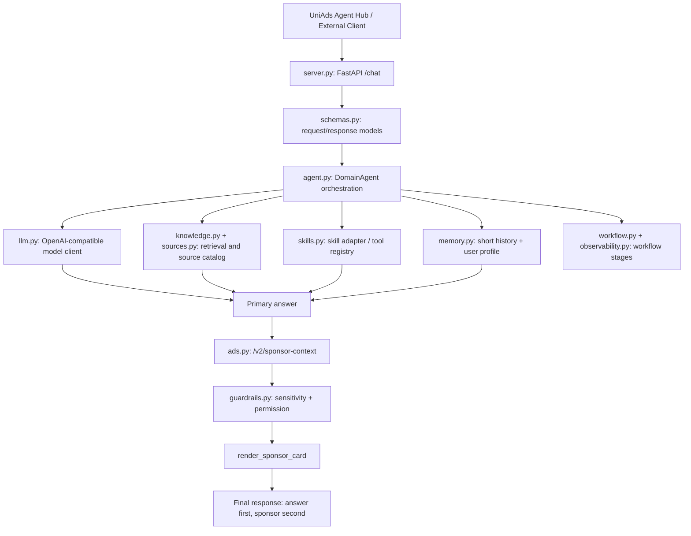

# Architecture

This template is intentionally useful without being heavy. It follows the durable pattern used by mature agent projects: keep orchestration, tools, memory, retrieval, model calls, guardrails, and platform integration as separate modules.

## Layer Figure

## Responsibility Table

| Layer | File | Responsibility | Safe To Replace? |
| --- | --- | --- | --- |
| HTTP | `server.py` | `/health` and `/chat` API | Yes |
| Schema | `schemas.py` | typed request/response objects for Agent Hub | Extend carefully |
| Agent | `agent.py` | orchestration and primary answer | Yes, main customization point |
| LLM | `llm.py` | OpenAI-compatible chat completions | Yes |
| Sources | `sources.py` | curated source catalog | Yes |
| Knowledge | `knowledge.py` | lightweight retrieval | Replace with vector DB/RAG later |
| Skills | `skills.py` | skill adapter and tool registry | Yes |
| Ads | `ads.py` | UniAds V2 sponsor context | Keep contract stable |
| Guardrails | `guardrails.py` | permission breakpoint | Extend carefully |
| Memory | `memory.py` | short history and extracted user profile | Replace with DB/Redis |
| Workflow | `workflow.py` | readable stage trace | Yes |
| Observability | `observability.py` | timing/logging hooks | Yes |
| Hub metadata | `uniads.agent.json` | Agent Hub registration fields | Update for your agent |

## 中文说明

这个模板不再只是一个聊天壳，而是一个可运行的 Agent 工程骨架。开发者可以替换 `agent.py`、`skills.py`、`sources.py` 和 `knowledge.py` 来构建自己的业务能力，同时保留 `ads.py` 的 UniAds V2 合同，确保赞助内容不会破坏用户主体验。
