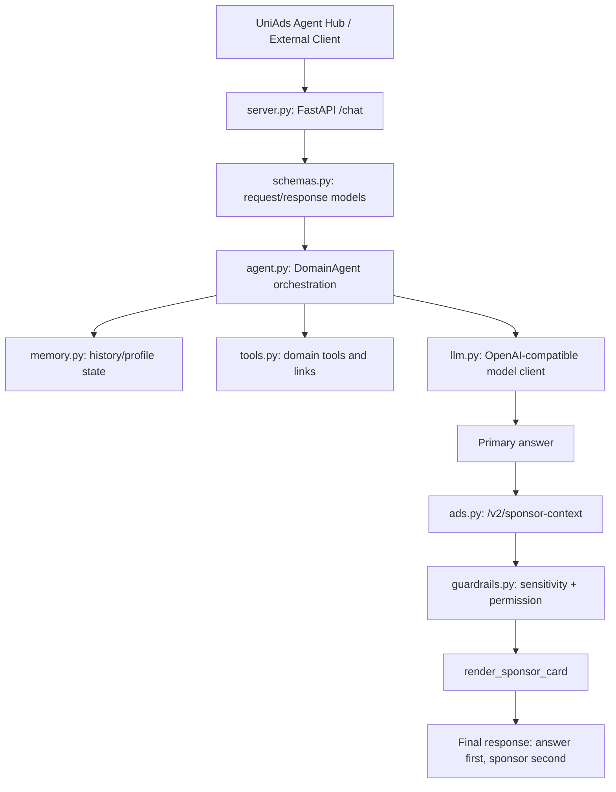

# Architecture

This template is intentionally small. The goal is not to hide complexity in a framework, but to show developers where every responsibility lives.

## Layer Figure

## Responsibility Table

| Layer | File | Responsibility | Safe To Replace? |
| --- | --- | --- | --- |
| HTTP | `server.py` | `/health` and `/chat` API | Yes |
| Schema | `schemas.py` | typed request/response objects | Extend carefully |
| Agent | `agent.py` | orchestration and primary answer | Yes, main customization point |
| LLM | `llm.py` | OpenAI-compatible chat completions | Yes |
| Ads | `ads.py` | UniAds V2 sponsor context | Keep contract stable |
| Guardrails | `guardrails.py` | permission breakpoint | Extend carefully |
| Memory | `memory.py` | simple session memory | Yes |
| Tools | `tools.py` | domain helpers and safe links | Yes |
| Hub metadata | `uniads.agent.json` | Agent Hub registration fields | Update for your agent |

## Request Flow

1. A user sends `/chat` request.
2. `DomainAgent` reads history and builds the primary answer.
3. The primary answer is preserved.
4. `UniAdsClient` calls `/v2/sponsor-context` with user context and draft response.
5. If sponsor matches, the compact card is appended after the answer.
6. If permission is required, the card includes the permission prompt and does not execute the sponsored action.
7. If UniAds or the model fails, the agent returns a safe fallback answer.

## ????

????????????????????? `agent.py` ? `tools.py`??? `ads.py` ? UniAds V2 ?????????????????? Agent???????????????????
